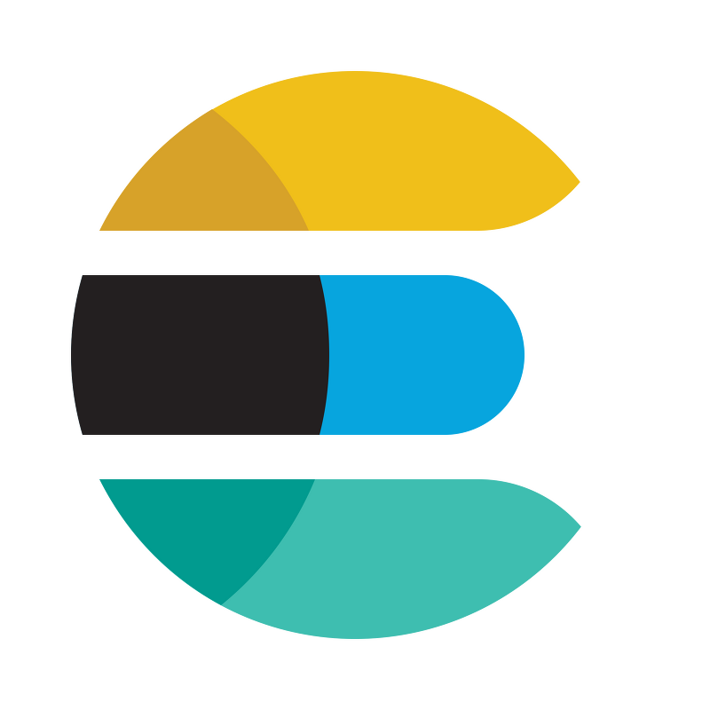

<p align="center">

  </p>

> Tesla 모의어플 백엔드

MySQL과 Nestjs를 이용해 구성했습니다.
Tesla 홈페이지를 참고하며 만들었습니다.
공부용이기에 없는 기능이 들어가 있기도 합니다.

## 목차

[목차](#목차)

[배포 주소](#배포-주소)

[서버,db 설계](#서버db-설계)

[기술 스택](#기술-스택)

[ERD 설계](#erd-설계)

[파이프 라인](#파이프-라인)

- [검색 파이프라인](#모델정보-검색-파이프라인)

[프로젝트 설치 및 실행 방법](#프로젝트-설치-및-실행-방법)

[업데이트 내역](#업데이트-내역)

[폴더 구조](#폴더-구조)

[.env 설정](#env-설정)

## 배포 주소

```sh
https://main-project.leo3179.shop/graphql
```

## 서버,DB 설계

- Server FrameWork : Nest.js & Graphql
- Build :
  - Code-first build
  - Graphql build : module - resolver - service (소셜 로그인과 health-checking용 controller는 존재)
- DB : Mysql (RDBMS)
- ORM : TypeORM

## 기술 스택

<br>
<div align='center'> 🖥&nbsp&nbsp&nbsp사용한 기술 스택</div>
<br>
<p align="center">
📑&nbsp&nbsp&nbsp구성 언어
  </p>
<p align="center">


  </p>
 <p align="center">
🏠&nbsp&nbsp&nbsp데이터베이스
  </p>
<p align="center">

&nbsp
&nbsp
&nbsp


  </p>
   <p align="center">
🚀&nbsp&nbsp&nbsp배포
  </p>
<p align="center">

&nbsp
&nbsp
&nbsp

&nbsp
&nbsp
&nbsp

  </p>
    </p>
       <p align="center">
🏖&nbsp&nbsp&nbspWith...
  </p>
<p align="center">


  &nbsp&nbsp

  </p>
  <p align="center">



  </p>
  <p align="center">
  
  </p>

## ERD 설계


```
🚛 Car
 └─ 🚙 CarType : 커스타미징 대분류( ex. model3,modelS...)
     │
     └─ 🚗 CarModel : 커스터마이징 중분류   <──> CarTag
     ( ex. model3LongRange,modelSPlaid)
        │
        └─ 🏎 CarCustom : 커스터마이징 소분류
   ┌──────( ex. model3LongRange(color: red,interior:black...)
   │        └─ CarWheel : 커스터마이징 소분류(휠 커스텀)
   │
💰 Payment
   │
   │
👩🏻‍💻 User
```

## 파이프 라인

### 모델정보 검색 파이프라인


## 프로젝트 설치 및 실행 방법

- git clone https://github.com/leokim1178/main-project-1
- terminal commands

```
# local
brew install mysql
mysql.server start
mysql_secure_installation
비밀번호(1234) 및 기타 설정
mysql -u root -p
Enter password : 1234
yarn start:dev

# local :  docker (권장)
docker 설치
docker compose build
docker compose up

# Deployed Server URL
URL : https://main-project.leo3179.shop/graphql
```

## 업데이트 내역

- 0.02.0
  - 리팩토링 & ELK 배포

## 폴더 구조

```

🏠 main-project
├─ 🐳 cloudbuild.yaml : CI/CD를 위한 github - gcp cloudbuild 연결 yaml
└─ main-project-for-deploy
├─ 🚀 backend
│ ├─ 🐳 docker-compose.yaml
│ ├─ 🐳 Dockerfile : my-backend
│ ├─ 🐳 Dockerfile.logstash : my-logstash
│ │ 데이터베이스는 gcp vm mysql로 대체했습니다
│ ├─ 🍦 elk
│ │ ├─ elasticsearch
│ │ │ └─ car_type_template.json
│ │ │ : elasticsearch settings & mappings template
│ │ ├─ /kibana
│ │ └─ /logstash : logstash.config 파일
│ ├─ /functions : 배포한 gcp functions 정리
│ ├─ 🎒 package.json
│ └─ src
│ ├─ 🍇 apis
│ │ ├─ auth : 로그인,로그아웃,소셜로그인 api
│ │ ├─ 🚗 car
│ │ │ ├─ /carCustom
│ │ │ ├─ /carImg
│ │ │ ├─ /carModel
│ │ │ ├─ /carTag
│ │ │ ├─ /carType
│ │ │ └─ /carWheel
│ │ ├─ /iamport : iamport에 정보 요청 및 환불을 위한 api
│ │ ├─ /payment : 결제 api
│ │ └─ /user : 회원가입, 회원정보 조회,수정 등
│ ├─ 👑 app.module.ts
│ ├─ 📄 commons
│ │ ├─ /auth : 로그인, 소셜 로그인, 로그아웃 auth strategies & guards
│ │ └─ /filter : exception filter
│ └─ main.ts
└─ 🚀 frontend
├─ /img
├─ login
│ ├─ index.css
│ └─ index.html
└─ payment.html

```

## .env 설정

1. 소셜 로그인 관련 keys(naver,google,kakao)
2. gcp storage & bigQuery 관련 keys

## 정보

블로그 : [leoKim's velog](https://story0tae.tistory.com/)
<br>
email : leo3179@naver.com

<!-- Markdown link & img dfn's -->

```

```
